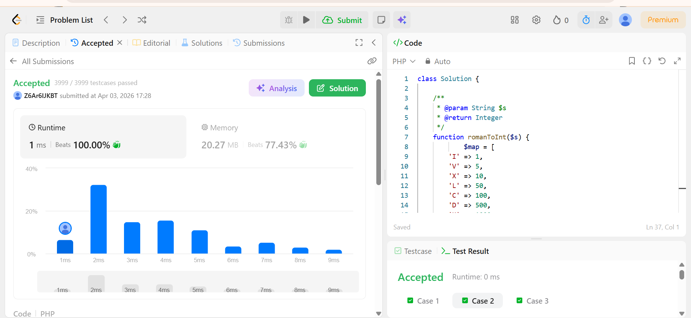

# Day 03 - CSV to MySQL Import

## Overview
Day 03 focuses on reading the CSV file generated on Day 02 and importing the records into a MySQL database using PHP and PDO.

The script reads user data from `day02/users.csv`, validates each row, inserts new records into a `users` table, and skips invalid or duplicate entries.

Day 03 also included a LeetCode practice task to strengthen problem-solving skills alongside the database work.

## Files

- `read_and_insert_data.php` - Main PHP script that loads environment variables, connects to MySQL, creates the table if needed, and imports CSV data
- `schema.sql` - Optional SQL schema for manually creating the database and `users` table
- `.env.example` - Example database environment variables used by the script

## Requirements

- PHP 8+ with PDO MySQL enabled
- MySQL server running locally or remotely
- A root-level `.env` file in the project directory
- `day02/users.csv` already generated

## Environment Setup

The script loads environment variables from the root `.env` file:

```env
DB_HOST=127.0.0.1
DB_PORT=3306
DB_NAME=test
DB_USER=root
DB_PASS=
```

Note: `read_and_insert_data.php` reads `../.env`, not `day03/.env`.

## How It Works

1. Loads database credentials from the root `.env` file
2. Locates `day02/users.csv`
3. Connects to MySQL using PDO
4. Creates the `users` table if it does not already exist
5. Reads the CSV file row by row
6. Validates each row before inserting
7. Skips malformed rows, empty values, negative ages, and duplicate emails
8. Prints a final import summary

## Validation Rules

- A row must contain at least 3 columns
- `name` must not be empty
- `email` must not be empty
- `age` must be zero or greater
- Duplicate emails are skipped because `email` is unique in the database

## Run The Script

From the project root:

```bash
php day03/read_and_insert_data.php
```

Example output:

```text
Import complete: 100 inserted, 0 skipped
```

## Manual Database Setup

If you want to create the schema manually before running the script:

```bash
mysql -u root -p < day03/schema.sql
```

The script can also create the `users` table automatically if the database already exists.

## Notes

- The CSV file is expected at `day02/users.csv`
- Imports run inside a database transaction
- Insert errors are reported to standard error and counted as skipped rows
- Duplicate records are ignored through `ON DUPLICATE KEY UPDATE`

## LeetCode Challenge

**Problem:** Roman to Integer

### Submission Details

- **Test Cases Passed:** 3999 / 3999
- **Submitted:** April 03, 2026 17:28
- **Runtime:** 1 ms
- **Runtime Ranking:** Beats 100.00%
- **Memory Usage:** 20.27 MB
- **Memory Ranking:** Beats 77.43%

### Submission Screenshot




### Approach Summary

We solve the Roman to Integer problem by scanning the string from right to left. We use a map to store the values of Roman numerals (`I=1`, `V=5`, `X=10`,`L=50`, `C=100`, `D=500`, `M=1000`, etc.). We keep two variables: total to store the result and prev to remember the value of the previous numeral.

For each character (starting from the end of the string), we get its numeric value. If the current value is less than the previous value, we subtract it from the total because it represents a subtractive case (like IV or IX). Otherwise, we add it to the total.

After processing each character, we update prev to the current value. At the end of the loop, the total contains the final integer value.

This approach works efficiently in one pass and correctly handles both normal and subtractive Roman numeral cases.
