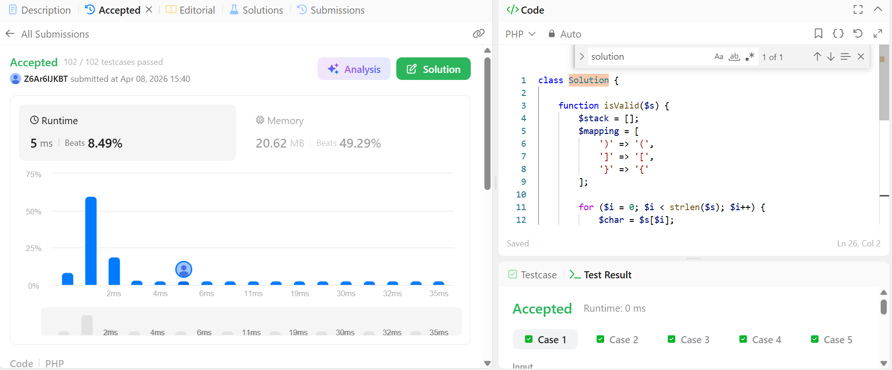

# Day 05 - Refactoring and Weekly Retrospective

## Overview
Day 05 focused on reviewing the work completed during Week 1, improving readability, preparing for interviews, and documenting lessons learned.

## Refactoring Review

### Improvements Made

- Added focused comments to the Day 03 PHP import script to explain environment loading, validation, and duplicate-handling logic
- Added focused comments to the Day 04 Node.js server to clarify connection pooling and the `/users` query
- Updated `.gitignore` to ignore `node_modules/` using the directory form
- Confirmed the repository README includes instructions for both the PHP import script and the Node.js API server

## Mock Interview Prep

### Sample Question

**Tell me about a time you fixed a bug in Node.js. How did you find it?**

### Answer

One time, I was working on a Node.js backend and noticed that one of my API endpoints was not working the way I expected. Instead of returning data, it was giving me an error. I started by checking whether the server was running correctly, because I wanted to make sure the problem was not coming from the application startup.

After that, I tested the endpoint directly and looked at the console logs. The error message showed `ECONNREFUSED 127.0.0.1:3306`, which helped me understand that the route itself was okay, but the application could not connect to the MySQL database. That was useful because it showed me the bug was not really in the endpoint logic, but in the connection to the database.

What I learned from that experience is that debugging works better when you break the problem into smaller parts. Instead of guessing, I checked the server, the route, and the database one by one. That made it much easier to find the real cause of the bug, and it helped me become more confident when solving backend problems.

## LeetCode Challenge

**Problem:** Merge Two Sorted Lists

### Solution File

### Approach Summary

The solution uses an iterative two-pointer technique with a dummy head node. We compare the current nodes in both sorted lists, attach the smaller one to the merged list, and move that pointer forward.

Once one list is exhausted, the remaining nodes from the other list are attached directly because they are already sorted. This approach runs in linear time and avoids creating unnecessary extra nodes.

### Complexity

- **Time:** `O(n + m)`
- **Space:** `O(1)` extra space

## Weekly Retrospective

### Week 1 Report Summary

- Learned how to generate CSV data with PHP
- Imported validated CSV data into MySQL using PDO
- Built a simple Node.js and Express API on top of the database
- Practiced algorithm problem-solving on LeetCode each day
- Improved documentation habits by writing daily summaries and setup notes

### Git Merge vs Rebase

`git merge` combines branches by creating a merge commit that preserves the full branch history. It is useful when you want to keep the real sequence of collaboration visible.

`git rebase` moves your branch commits onto a new base commit, which creates a cleaner and more linear history. It is useful for cleaning up local work before sharing it, but it rewrites commit history.

