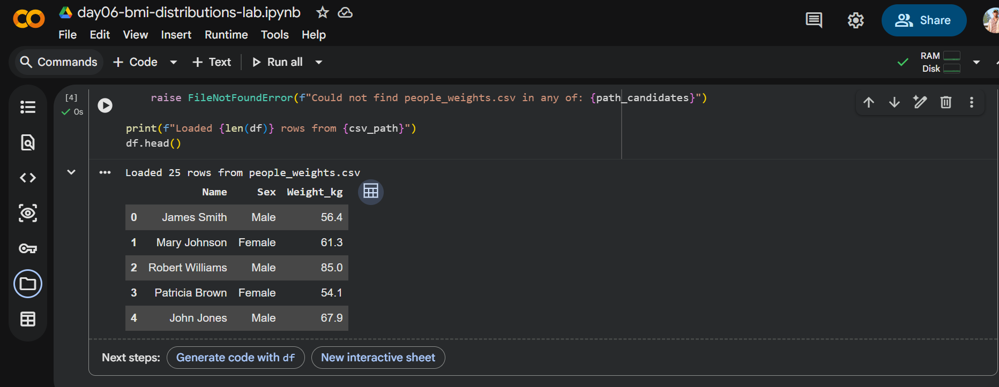
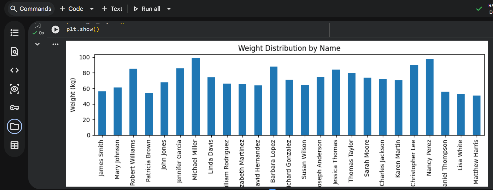
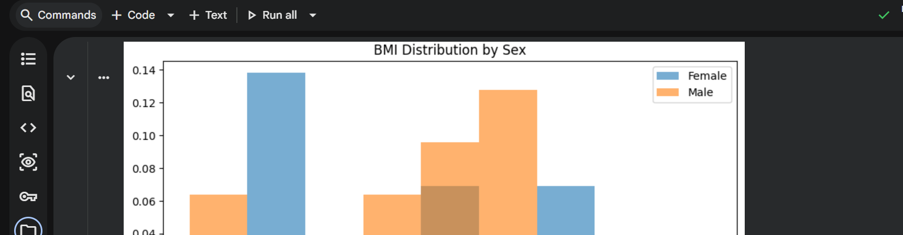

# Day 06 - Introduction to Machine Learning

## Overview
Day 06 focused on building a strong foundation in machine learning concepts and understanding how ML differs from traditional programming. The goal was to develop the right mental model before moving into more practical machine learning tasks later in the internship.

## Definition of Done

Today I learned that machine learning is a way of teaching computers to identify patterns in data and make predictions without being explicitly programmed with fixed rules for every situation. I understood the difference between traditional programming and machine learning: in traditional programming, developers write direct instructions, while in machine learning, the system learns from examples and uses that learning to make decisions on new data.

I explored the three main categories of machine learning. Supervised learning uses labeled data to predict outcomes such as house prices, spam emails, or crop yields. Unsupervised learning works with unlabeled data to discover hidden patterns such as customer groups or unusual behavior. Reinforcement learning allows systems to improve by learning from actions, rewards, and mistakes over time.

I also learned the standard machine learning workflow. This starts with defining the problem, collecting the right data, cleaning and preparing that data, training a model, evaluating how well it performs, and finally deploying it for real use. One important takeaway from today is that data preparation takes a large portion of the work in machine learning, often more than building the model itself.

Another key part of today was seeing real-world machine learning applications, especially in African contexts. I learned that ML can support agriculture through crop yield prediction, improve healthcare with diagnosis support tools, strengthen finance through credit scoring, help retailers forecast demand, and support education through personalized learning experiences. These examples helped me connect machine learning concepts to real problems that affect communities and businesses.

I was also introduced to Python tools commonly used in data science and machine learning, including Pandas for working with datasets, NumPy for numerical operations, Matplotlib for visualization, and Scikit-learn for building machine learning models. This gave me a clearer picture of the tools I will likely use in future ML exercises and projects.

## Lab - Python Data Analysis: BMI & Distributions

### Goal
Use pandas + numpy + matplotlib to load a small dataset, visualize weights, engineer heights + BMI, and compare BMI distributions by gender.

### Setup
- Install packages:

```bash
pip install pandas numpy matplotlib scikit-learn
```

### Dataset
- File: `day06/people_weights.csv`
- Columns used:
  - `Name`
  - `Sex` (Male/Female)
  - `Weight_kg`

### What I did
- Loaded the CSV into a DataFrame (`df`) and validated shape + columns.
- Plotted a bar chart of `Weight_kg` by `Name` to get a quick sense of relative weights.
- Generated a synthetic `Height_cm` feature using a reproducible random integer range \([150, 200]\) and converted it into `Height_m`.
- Computed BMI using:

\[
BMI = \frac{weight_{(kg)}}{height_{(m)}^2}
\]

- Compared BMI distributions for Female vs Male using overlapping histograms (same bins, `density=True`) for readability.

### Key observations
- Feature engineering (even synthetic) is straightforward with pandas + numpy, and it unlocks downstream analysis quickly.
- For distribution comparisons, using consistent binning and transparency makes overlaps easier to interpret.

### Artifacts
- Notebook: `day06/day06-bmi-distributions-lab.ipynb`
- Dataset: `day06/people_weights.csv`

### Execution (Google Colab)
I ran the notebook in **Google Colab** and verified the full flow:
- CSV loaded successfully
- Weight bar chart rendered
- BMI distribution by sex rendered

#### Screenshots (Colab run)







## Key Takeaways

- Machine learning helps computers learn patterns from data instead of relying only on hard-coded rules.
- Supervised, unsupervised, and reinforcement learning solve different types of problems.
- The machine learning workflow moves from problem definition to data, training, evaluation, and deployment.
- Good data preparation is one of the most important parts of any machine learning project.
- Machine learning has practical uses in Africa across agriculture, healthcare, finance, retail, and education.
- Python libraries such as Pandas, NumPy, Matplotlib, and Scikit-learn are essential tools for ML work.
